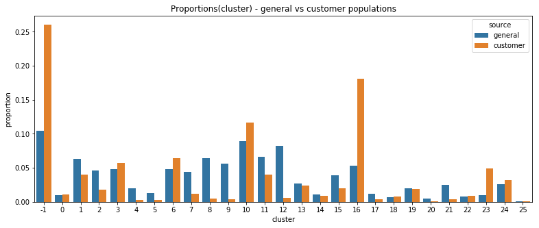

## Unsupervised Learning - Identify Customers Segments

## Project description
In this project I've applied unsupervised learning to identify 
characteristics of people who are buying company products and characteristics of people who are not. 
The project was completed as part of my Data Science Graduation at [Udacity](https://www.udacity.com/).

I've worked with two datasets. One with demographic information about the people of Germany, and one with the same information for customers of a mail-order sales company.

To get the answers:
First, I've done data preprocessing:
- Missing values were converted into NaNs. From the dataset were removed columns with missing rate above 50%.
- Categorical and mixed variables were encoded.
Then, I've done feature transformation:
- First, feature scaling. Then I've performed dimensionality reduction with sklean's PCA. 
Lastly, I've clustered data into segments.

Results:
- After comparing population that were customers with population that were not and evaluating categories like wealth, age, financial habits, personality typology (dominance affinity) and movement patterns:
- The customer cluster is made of persons with high wealth, age 46 and more, with good financial habits (money-savers), dominant, low movement.
- The non-customer cluster is made of persons from poorer households, younger age (0-45 years), without money-savings habits, not-dominant, high movement.

## Usage
This project uses real-life data provided by Bertelsmann partners AZ Direct and Arvato Finance Solution. 
Data are confidential. The source code and the findings are public. You can follow executed steps in `Identify_Customer_Segments.ipynb`

## Libraries used
Python 3
- pandas
- numpy
- matplotlib
- seaborn
- sklearn

## Files in the repository
There were four data files associated with this project. 
- `Udacity_AZDIAS_Subset.csv`: (confidential) Demographics data for the general population of Germany; 891211 persons (rows) x 85 features (columns). 
- `Udacity_CUSTOMERS_Subset.csv`: (confidential) Demographics data for customers of a mail-order company; 191652 persons (rows) x 85 features (columns).
- `Data_Dictionary.md`: (confidential) Detailed information file about the features in the provided datasets.
- `AZDIAS_Feature_Summary.csv`: (confidential) Summary of feature attributes for demographics data; 85 features (rows) x 4 columns

Published repository contains:
- `Identify_Customer_Segments.ipynb`: source code to identify customer segments from the dataset